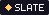
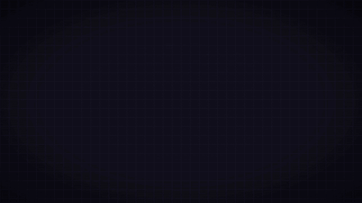

 

 
 

**도트를 찍으면 바로 게임이 되는 픽셀 게임 엔진**

 

[English](README.md) · **한국어**

## 설치

[Releases](https://github.com/Erzyh/slate-engine/releases/latest)에서 `Slate_x.y.z_x64-setup.exe`를 받아 설치하고 실행하면 끝이다 (Windows 10/11). 새 버전이 나오면 에디터가 알려 주고 바로 업데이트한다.

## 문서

- [시작하기](docs/ko/getting-started.md): 템플릿으로 첫 게임 만들기
- [에디터](docs/ko/editor.md): 프로젝트 폴더, 픽셀·맵 에디터, 소리, 내보내기
- [게임 코드 API](docs/ko/api.md): Luau 함수와 표준 라이브러리 (애니메이션, 충돌, 카메라, 대화창, 메뉴…)

## 라이선스

- Slate: **MIT**
- 내장 글꼴 ERXPIXEL: **SIL OFL 1.1**
